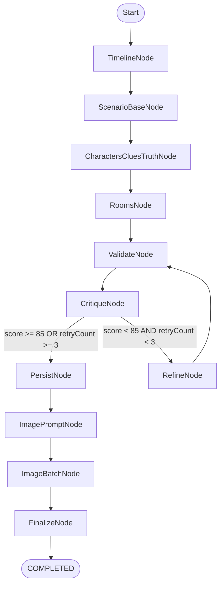

# S14P11A707 Backend Plan / Tech Spec (Living Doc)

- Last updated: 2026-02-01
- Scope: `S14P11A707-backend`
- Status: Draft (대화로 계속 갱신)

---

## 0. 핵심 결정 사항(합의)

- **v1은 유지**: 기존 `ScenarioApi`/`ScenarioServiceImpl`(기준 impl)은 그대로 둔다.
- **v2 신규**: “시나리오 생성”만 담당하는 API/Service를 새로 만든다.
- **v2 DTO 분리**: v1 DTO와 섞지 않고 v2 전용 Request/Response/Event로 정의한다.
- AI 파이프라인: **Spring AI Graph(StateGraph)** + **Critique/Refine loop(최대 3회, 85점 기준)**.
- 실시간 진행: **Redis Pub/Sub + SSE(SseEmitter)**.
- Redis 관련 설정은 `RedisConfig`에서 통합 관리(캐시/템플릿/리스너 등).
- 이미지: “30장 고정”이 아니라 **엔티티 이미지 URL 필드 기준(가변 개수)**.
- 이미지 실패 정책: 이미지 생성/업로드 실패 시 **시나리오 생성 전체 FAILED**.
- 재연결: SSE 재연결 시 **진행률 리셋**(복구/리플레이/스냅샷 저장 안 함).
- SSE 연결: `complete/error` 이벤트 후 서버가 `emitter.complete()`로 **연결 종료**(생성 단위로 연결 여닫는 모델).
- 비동기 실행: “시나리오 생성 job executor”와 “이미지 병렬 executor”를 **분리**한다.
- 동시 생성 제한: 사용자당 `generationStatus=GENERATING` 시나리오는 **1개만 허용**한다(중복 요청은 409).
- UX 문구: 진행 이벤트에 **스토리텔링 message** 포함, 이미지 단계는 `{done}/{total}` 제공.
- “30장급 장면 이미지(씬/컷)” 생성은 이번 범위 아님(예시였음).

---

## 1. Rooms는 현재 생성에서 담당하나?

**예. v1 시나리오 생성(`ScenarioServiceImpl.createScenario`)이 방(rooms)까지 생성/저장한다.**

- Step 4: LLM에 “6개의 층별 방(rooms) 생성”을 요청하는 프롬프트가 존재
- DB 저장: 생성된 `roomsNode`를 순회하며 `Room` 엔티티를 저장
- 저장 시 `RoomLayoutService.generateRandomLayout(roomType)`로 `objectJson`(가구/배치)까지 생성해 넣음
- (코드 참고) `ScenarioServiceImpl.java:338` (생성 단계), `ScenarioServiceImpl.java:554` (저장 단계)

즉 “Rooms가 따로 생성된다”기보다는, **시나리오 생성 파이프라인의 한 단계**로 포함돼 있는 구조다.

---

## 2. 이미지 범위(무엇을 만들 것인가)

### 2.1 실제 DB/엔티티에 존재하는 이미지 URL 필드

현재 백엔드에서 “저장되는 이미지 URL”은 아래 4종만 존재한다.
- `Scenario.thumbnailUrl`
- `Victim.portraitUrl`
- `Suspect.portraitUrl`
- `Clue.detailImageUrl`

`Room`에는 이미지 URL 필드가 없다(프론트도 방 이미지는 정적 리소스 사용).

### 2.2 이미지 개수는 가변

v1 프롬프트/생성 규칙상:
- Victim: 1
- Suspects: `suspectCount` (프론트는 4 또는 5)
- Clues: 8~12
- Rooms: 6

따라서 총 이미지:
- `totalImages = 2 + suspectCount + clueCount`
- 예: 14~19장 수준

---

## 3. v2 API / DTO / 전체 흐름

### 3.1 API (v2)

- `POST /api/v2/scenarios`
  - 시나리오 생성 시작(Non-blocking)
  - Response: `ScenarioV2CreateResponse`
- `GET /api/v2/scenarios/stream`
  - SSE 연결(Authorization 기반 userId 식별)
  - Event: `connect`, `progress`, `complete`, `error`

옵션(필요해지면 추가):
- `DELETE /api/v2/scenarios/{scenarioId}` (취소)

### 3.2 DTO (v2)

- `ScenarioV2CreateRequest`
  - `title`, `genre`, `suspectCount`, `userSynopsis` (+ 필요 시 v2 확장)
- `ScenarioV2CreateResponse`
  - `scenarioId`: long
  - `status`: `GENERATING | COMPLETED | FAILED` (+ 취소 지원 시 `CANCELED`)
  - `estimatedTimeSeconds`: int? (optional)
  - `errorMessage`: string? (optional)
- `ScenarioV2StreamEvent`
  - `scenarioId`: long
  - `type`: stage/event type
  - `progress`: int (0~100)
  - `message`: string (스토리텔링 문구)
  - `data`: object? (예: `{ "done": 3, "total": 15 }`)

### 3.3 End-to-end 흐름(주문 + 호출벨 모델)

사용자 “생성” UX 흐름은 네가 적어준 비유가 거의 그대로다.

1) **SSE 연결(듣기 모드)**
   - Client가 `GET /api/v2/scenarios/stream` 연결
   - Server가 `SseEmitter` 생성 후 in-memory map 저장(`userId -> emitter`)
2) **생성 요청(주문)**
   - Client가 `POST /api/v2/scenarios`
   - Server는 즉시 응답 반환(Non-blocking) + 백그라운드 작업 시작
3) **실시간 중계**
   - 백그라운드 작업(별도 스레드)이 단계별로 Redis publish
   - Redis subscriber가 메시지 수신 → 해당 user emitter로 `send(...)`
4) **완료**
   - 완료 이벤트 전송 후, job 단위 연결이면 `emitter.complete()`로 종료

주의:
- `userId`는 query/body로 받기보다 **Bearer(OIDC subject)** 로 식별 권장(위조 방지).
- Redis는 “병렬 처리 엔진”이 아니라 **이벤트 브로드캐스트/브릿지** 역할. 병렬 이미지 생성은 `ImageBatchNode`의 thread pool에서 수행.

SSE(토이프로젝트 권장 운영):
- **Last-Event-ID 기반 “이벤트 리플레이”는 하지 않는다.**(이벤트 로그 저장/재전송까지 설계가 커짐)
- **재연결 UX는 “리셋(0부터 다시)”으로 간다.** (진행 상황 복구/스냅샷 저장 안 함)
- SSE keep-alive를 위해 10~15초마다 `ping` 이벤트(또는 comment) 전송 권장.

Graph(구현 방식):
- “Spring AI StateGraph”라는 별도 artifact를 현재 프로젝트 의존성(Spring AI 1.1.x)에서 확인하지 못했기 때문에,
  v2는 **Node 인터페이스 + Runner(조건 분기/loop)** 로 “StateGraph 패턴”을 내부 구현한다.
- LLM 호출은 기존과 동일하게 **Spring AI `ChatClient`** 를 사용한다.

---

## 4. Graph 설계 (Spring AI StateGraph)

### 4.1 Node 흐름(권장, 순차 분해)

**원칙: 시나리오 생성은 의존성이 강하므로 “병렬 분해”보다 “순차 단계 분해 + (필요 시) 부분 재생성”이 안정적이다.**

| Node | 역할 | 진행률(%) |
|---|---|---:|
| `TimelineNode` | cast + timeline 생성 | 10 |
| `ScenarioBaseNode` | scenario(title/synopsis/synopsisDetail/story_config_json) 생성 | 20 |
| `CharactersCluesTruthNode` | victim/suspects/clues/truth_config_json 생성 | 30 |
| `RoomsNode` | rooms(6층) 생성 (clues를 room description에 자연스럽게 반영) | 45 |
| `ValidateNode` | 결정론 검증(스키마/개수/참조/중복) + 오류 리포트 생성 | 50 |
| `CritiqueNode` | LLM-as-judge로 개연성 평가 + 점수(0~100) + mustFix/refineInstructions | 55 |
| `RefineNode` | 보강(루프): (A) 전체 JSON 편집 or (B) 원인 단계만 재생성 | 55(유지) |
| `PersistNode` | DB 저장(Scenario/Victim/Suspect/Clue/Room) + IDs 확보 | 60 |
| `ImagePromptNode` | ImageJob 목록 + prompt 생성(IDs 포함 objectKey 확정) | 65 |
| `ImageBatchNode` | ImageJob 병렬 생성 + MinIO 업로드 + URL 업데이트 | 65→95 |
| `FinalizeNode` | status COMPLETED 확정 + 완료 이벤트 | 100 |

분기:
- `critiqueScore >= 85` OR `retryCount >= 3` → `PersistNode`
- else → `RefineNode` → `ValidateNode` → `CritiqueNode`

### 4.2 score / retryCount / 보강 전략(요약)

- score(0~100)는 **결정론 Validate 결과 + LLM-as-judge(Critique)** 를 합쳐서 운영
- retryCount는 **RefineNode 실행 횟수**(max 3)
- 보강은 기본적으로 “편집 기반”(최소 변경) 권장, 고급으로 “원인 단계만 재생성”도 가능

---

## 5. Mermaid (가독성 우선 버전)

메모:
- **FAILED/CANCELED 등 예외 플로우는 가독성을 위해 생략**했다. 실제 구현에서는 어떤 노드에서든 error/cancel 발생 시 terminal 상태로 종료한다.

---

## 6. 이벤트/진행 문구

### 6.1 이벤트 스키마(권장)

`ScenarioEventMessage`
- `userId`: string
- `scenarioId`: long
- `type`: `TIMELINE | CHARACTERS_CLUES_TRUTH | ROOMS | VALIDATE | CRITIQUE | REFINE | PERSIST | IMAGE_PROMPT | IMAGE_PROGRESS | FINALIZE | ERROR` (+ 취소 지원 시 `CANCELED`)
- `message`: string (스토리텔링 문구)
- `progress`: int (0~100)
- `data`: object? (예: `{ "done": 7, "total": 19 }`)

### 6.2 문구 예시(초안)

- Timeline(10%): “탐정이 사건 개요를 받아 적는 중이에요.”
- Characters/Clues(30%): “탐정이 증거물들을 검토하고 있어요…”
- Rooms(45%): “현장을 재구성하고 있어요…”
- Critique(55%): “알리바이의 모순을 찾는 중…”
- Refine(loop): “허점을 보강하고 있어요… (재검토 {retry}/3)”
- ImagePrompt(65%): “증거 사진 촬영 지시서를 작성 중…”
- ImageProgress(65~95%): “증거 사진을 확보 중… ({done}/{total})”
- Finalize(100%): “수사 보고서를 마무리하는 중…”

---

## 7. 이미지 병렬 처리(요약)

- `ImageBatchNode` 내부에서 fixed thread pool로 병렬 생성
- 각 이미지 완료 시 `IMAGE_PROGRESS` 이벤트 publish(`done/total`)
- 진행률 계산(권장):
  - `progress = 65 + floor(30 * done/total)` (이미지 단계)
  - Finalize에서 100

MinIO objectKey(권장):
- `scenarios/{scenarioId}/thumbnail.png`
- `scenarios/{scenarioId}/victim/{victimId}.png`
- `scenarios/{scenarioId}/suspects/{suspectId}.png`
- `scenarios/{scenarioId}/clues/{clueId}.png`

실패 정책(합의):
- 이미지 생성/업로드 실패 시 전체 FAILED

재시도(합의):
- 이미지 1장당 **최대 2회 재시도**(총 3회 시도) 후 실패 시 전체 FAILED
- backoff(권장): `300ms -> 1s`(+ jitter 소량)

구현 메모(v2):
- 기본은 `GoogleGenAiImagenImageGenerator`(Google GenAI Imagen)로 실제 이미지를 생성한다.
- 이미지 모델은 `app.scenario.v2.image.model`로 교체 가능(예: `imagen-4.0-fast-generate-001`).

---

## 8. CANCELED(옵션) 추가 이유

추가가 필요한 경우:
- 사용자가 “취소”를 눌러 중단한 케이스를, 시스템 오류(FAILED)와 **명확히 구분**하고 싶을 때
- UI 문구/재시도 정책/운영 로그를 단순화하고 싶을 때

---

## 9. RedisConfig 통합(정리)

- 기존 `CacheConfig`는 `RedisConfig`로 정리(캐시 관련 bean/상수는 여기에 둔다).
- v2에서 Redis Pub/Sub, RedisTemplate(serializer) 등이 필요해지면 **동일 `RedisConfig`에 모아서** “Redis 한 곳 관리” 원칙을 유지한다.
