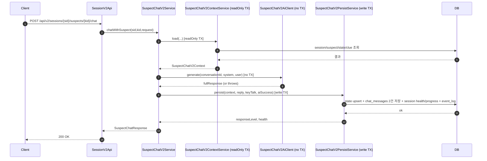

# Game Chat v2 튜토리얼 (긴 트랜잭션 제거)

이 문서는 `game/v2`에 추가된 **용의자 채팅 v2** 구현을 “왜 이렇게 했는지(원리)”와 “코드가 어떻게 동작하는지(구조)” 중심으로 설명합니다.

> TL;DR  
> v1은 `@Transactional` 안에서 AI 호출(수 초~)을 기다리면서 **DB 트랜잭션/커넥션을 오래 점유**했습니다.  
> v2는 **DB 읽기(짧게) → AI 호출(트랜잭션 없음) → DB 저장(짧게)** 로 분리해서, 동시 사용자 증가 시에도 DB 병목이 크게 줄어듭니다.

---

## 1) 왜 “긴 트랜잭션”이 문제인가?

### 트랜잭션(Transaction)과 커넥션(Connection)의 관계
- Spring `@Transactional`은 보통 DB 커넥션을 잡고(혹은 커넥션 풀에서 빌리고) **트랜잭션 경계**를 만듭니다.
- 트랜잭션이 시작된 동안에는:
    - 커넥션이 점유될 수 있고(특히 JPA flush/쓰기 포함 시),
    - 같은 데이터(row)에 대해 잠금 경쟁 가능성이 커지고,
    - 커넥션 풀이 작으면 다른 요청이 **커넥션을 못 구해서 대기**하게 됩니다.

### AI 호출은 “느린 외부 I/O”
- `chatClient.prompt()...blockLast()`는 외부 모델 호출(네트워크 + 모델 처리)이라 **수 초 이상** 걸릴 수 있습니다.
- 이 시간을 트랜잭션 내부에 포함하면:
    - DB 커넥션이 놀면서 점유(혹은 트랜잭션 컨텍스트 유지),
    - 동시 요청이 쌓이면 DB 풀 고갈/대기로 전체가 느려집니다.

**따라서** AI 호출은 DB 트랜잭션 밖으로 빼는 것이 정석적인 개선 방향입니다.

---

## 2) v2의 목표와 정책

### 목표
1. AI 호출 동안 **DB 트랜잭션을 잡지 않는다**
2. 기능/응답 스펙은 v1과 거의 동일하게 유지한다
3. 장애 시에도 UX가 망가지지 않게 “기록 + 응답”을 남긴다

### 실패 정책(구현된 동작)
- AI 호출 실패(타임아웃/예외 등) 시:
    - 응답은 HTTP 200으로 반환(프론트가 단순 처리 가능)
    - `response`에 고정 에러 문구 반환
    - DB에는 **유저 메시지 1건 + 용의자(에러) 메시지 1건** 저장
    - 체력(`health`)은 **감소하지 않음**

고정 에러 문구는 `SuspectChatV2Service`의 `AI_FAILURE_MESSAGE`를 사용합니다.

---

## 3) 새 엔드포인트(v2)

### URL
- `POST /api/v2/sessions/{sessionId}/suspects/{suspectId}/chat`

### 컨트롤러
파일: `src/main/java/com/ssafy/s14p11a707/game/v2/api/SessionV2Api.java`

- 인증된 유저의 `userId`를 구하고,
- `GameSessionAccessPolicy.assertSessionOwner(userId, sessionId)`로 소유권을 체크한 뒤,
- `SuspectChatV2Service.chatWithSuspect(...)`를 호출합니다.

---

## 4) 전체 아키텍처(3단 분리)

v2는 “느린 AI 호출”을 가운데 두고, DB 접근을 앞뒤로 짧게 끊었습니다.

```text
(짧은 Read TX) Context Load  →  (TX 없음) AI Call  →  (짧은 Write TX) Persist
```

### 시퀀스 다이어그램(개념)



---

## 5) 각 컴포넌트 설명(코드 따라가기)

### 5.1 `SuspectChatV2Service` (오케스트레이터)
파일: `src/main/java/com/ssafy/s14p11a707/game/v2/service/SuspectChatV2Service.java`

역할:
1. Context 로드(짧은 read-only TX)
2. 프롬프트 생성
3. AI 호출(트랜잭션 없음)
4. Persist(짧은 write TX)
5. 성능 로그 출력(`contextMs`, `aiMs`, `persistMs`, `totalMs`)

핵심 포인트:
- `callAi(...)`에서 예외를 잡고 **고정 실패 메시지**로 대체합니다.
- `parseAiResponse(...)`에서 `[KEY_TALK: true/false]` 메타를 파싱해 `reply`와 `keyTalk`를 분리합니다.

### 5.2 `SuspectChatV2ContextService` (read-only 트랜잭션)
파일: `src/main/java/com/ssafy/s14p11a707/game/v2/service/SuspectChatV2ContextService.java`

역할:
- DB에서 필요한 정보만 읽어서 `SuspectChatV2Context`로 묶어 반환합니다.

여기서 하는 것:
- 세션 존재/PLAYING 검증, health>0 검증
- suspect 존재/시나리오 일치 검증
- aiConfigJson에서 성격/말투/알리바이 progression/weakness clue 추출
- `SessionSuspectState`가 있으면 레벨을 읽고, 없으면 레벨 1로 간주(생성은 저장 단계에서)
- usedClueId가 있으면 clue를 조회해서 **유저 메시지에 단서 포맷을 붙여** AI에게 전달할 메시지를 구성
- `conversationId = "session-{sessionId}-suspect-{suspectId}"` 생성

중요한 설계:
- **여기서는 저장을 하지 않습니다.**
- 대신 “프롬프트용 레벨(`promptInterrogationLevel`)”을 계산합니다.  
  예: state가 1이어도, weakness clue를 이번 요청에서 제시했다면 프롬프트만큼은 level2로 응답하도록 유도.

### 5.3 `SuspectChatV2PromptBuilder` (프롬프트 생성)
파일: `src/main/java/com/ssafy/s14p11a707/game/v2/service/SuspectChatV2PromptBuilder.java`

역할:
- v1에 있던 “용의자 심문 규칙/행동 지침”을 v2에서 재사용 가능하게 캡슐화합니다.
- `promptInterrogationLevel`에 따라 Level1/Level2 규칙을 갈라서 system prompt를 만듭니다.

### 5.4 `SuspectChatV2AiClient` + `SpringAiSuspectChatV2AiClient`
파일:
- `src/main/java/com/ssafy/s14p11a707/game/v2/service/SuspectChatV2AiClient.java`
- `src/main/java/com/ssafy/s14p11a707/game/v2/service/SpringAiSuspectChatV2AiClient.java`

역할:
- AI 호출 부분을 인터페이스로 분리해서 **테스트에서 쉽게 mock**할 수 있게 합니다.
- Spring AI `ChatClient`를 사용해:
    - system/user message 설정
    - `MessageChatMemoryAdvisor`로 대화 메모리 적용
    - streaming content를 `StringBuilder`로 모아서 반환합니다.

### 5.5 `SuspectChatV2PersistService` (write 트랜잭션)
파일: `src/main/java/com/ssafy/s14p11a707/game/v2/service/SuspectChatV2PersistService.java`

역할:
- 짧은 트랜잭션으로 “상태 변경 + 대화 저장”만 수행합니다.

여기서 하는 것:
1. 세션/용의자 재검증(세션 상태/health 변동 등 안전장치)
2. `SessionSuspectState` 업서트(없으면 생성, weakness clue면 level2로 승격)
3. `chat_messages`에 2건 저장
    - user: role=`user`, usedClueId 저장
    - suspect: role=`suspect`, responseLevel 저장
    - AI 실패 시: `keyTalk`는 false로 저장
4. health 업데이트
    - AI 성공이면 -5
    - 실패면 유지
5. `session.updateProgress()` 및 `event_logs`에 CHAT_STARTED 저장

---

## 6) ChatMemory 최적화(최근 20개만 로드)

### 변경 이유
대화가 길어질수록 매 요청마다 전체 히스토리를 읽으면:
- DB I/O 증가
- 프롬프트 길이 증가 → 모델 응답 시간/비용 증가

### 구현
1) Repository 메서드 추가  
   파일: `src/main/java/com/ssafy/s14p11a707/game/repository/ChatMessageRepository.java`

- `findTop20BySessionIdAndSuspectIdOrderByCreatedAtDesc(...)`

2) ChatMemoryRepository 변경  
   파일: `src/main/java/com/ssafy/s14p11a707/game/ai/CustomChatMemoryRepository.java`

- DB에서 DESC로 20개를 가져온 뒤,
- 모델 입력은 시간순(ASC)이 자연스러우니 리스트를 역순으로 뒤집어 반환합니다.

> `MessageWindowChatMemory.maxMessages(20)`과 의미가 동일해서, 기능적 변화 없이 성능만 개선되는 효과를 기대할 수 있습니다.

---

## 7) “긴 트랜잭션 제거”가 실제로 어떻게 보이나?

v1:
- 트랜잭션 시작 → DB 조회 → AI 호출(대기) → DB 저장 → 트랜잭션 종료  
  → AI 대기 시간이 그대로 트랜잭션 길이가 됨

v2:
- (read-only TX) 짧게 조회 후 종료
- AI 호출(트랜잭션 없음)
- (write TX) 짧게 저장 후 종료

즉, AI가 5초 걸려도 write 트랜잭션은 5초가 아니라 “저장에 필요한 시간”만큼만 유지됩니다.

---

## 8) 테스트는 어떻게 작성되어 있나?

### `SuspectChatV2ServiceTest`
파일: `src/test/java/com/ssafy/s14p11a707/game/v2/service/SuspectChatV2ServiceTest.java`
- `SuspectChatV2AiClient`를 mock해서:
    - KEY_TALK 파싱이 제대로 되는지
    - AI 예외 시 실패 메시지로 처리하는지
    - persistService 호출 인자가 기대대로인지 검증

### `SuspectChatV2PersistServiceTest`
파일: `src/test/java/com/ssafy/s14p11a707/game/v2/service/SuspectChatV2PersistServiceTest.java`
- Repository들을 mock하고,
- AI 성공/실패에 따른 health 변화,
- weakness clue 사용 시 레벨 승격 저장을 검증합니다.

### `CustomChatMemoryRepositoryTest`
파일: `src/test/java/com/ssafy/s14p11a707/game/ai/CustomChatMemoryRepositoryTest.java`
- “DESC로 가져온 최근 20개”를 “ASC로 반환”하는지 검증합니다.

---

## 9) 자주 하는 실수/주의점

1) `@Transactional` 메서드 안에서 AI 호출/외부 API 호출하기  
   → 트랜잭션/커넥션이 길게 잡혀서 병목이 됩니다.

2) read-only 트랜잭션에서 엔티티 변경하기  
   → 의도치 않은 flush나 예측 불가한 동작이 나올 수 있으니, v2처럼 “읽기/쓰기 서비스”를 분리하는 편이 안전합니다.

3) 대화 히스토리 무제한 로드  
   → DB/모델 양쪽 모두 비용이 증가합니다. window를 유지하세요.

---

## 10) 다음 단계(원하면 확장 가능)

- **진짜 비동기**로 바꾸기
    - 즉시 jobId 반환 + SSE/폴링으로 결과 전달(시나리오 v2 방식)
    - 프론트 변경 필요
- 동시성/중복요청 방어
    - per-session queue
    - idempotency key(요청 중복 저장 방지)
    - 세션 row 락(PESSIMISTIC_WRITE) 또는 `@Version` 낙관적 락 도입

---

## 부록: 로컬에서 호출 예시(인증 생략 불가 주의)

이 API는 OIDC 인증이 필요합니다. Swagger UI에서 로그인 후 호출하거나, 테스트 토큰/인증 설정을 갖춘 환경에서 호출하세요.

```bash
curl -X POST "http://localhost:8080/api/v2/sessions/1/suspects/2/chat" \
  -H "Content-Type: application/json" \
  -d '{"message":"당신은 어디에 있었죠?","usedClueId":null}'
```

