# 홍연 프로젝트 시연 시나리오

## 1. 메인 페이지 (인덱스 페이지)
- 접속 주소: https://hongyeon.cloud-ip.cc/
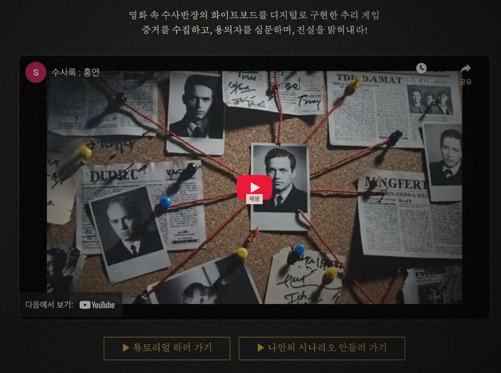
### 1-1. 시놉시스 영상 시청
- 화면 중앙에 위치한 유튜브 영상을 클릭하여  
  **홍연 프로젝트의 시놉시스 영상**을 바로 시청 가능
- 컨셉:  
  - 불안정한 정신세계 속에서  
  - 증거물을 쫓아가며  
  - 범인을 찾아가는 수사 컨셉 영상

### 1-2. 튜토리얼 체험
- 영상 하단의 **[튜토리얼 하기]** 버튼 클릭
- 기본적인 게임 플레이 방법 체험 가능
- 이후 **`2-1. 튜토리얼 체험`** 단계로 이동

### 1-3. 시나리오 생성 이동
- 영상 하단의 **[나만의 시나리오 만들러 가기]** 버튼 클릭
- 로그인 필수
- 이후 **`5. 시나리오 생성 정보 입력`** 단계로 이동

---

## 2. 튜토리얼

### 2-1. 튜토리얼 입장
- 튜토리얼 시나리오  
  **「첫 번째 사건: 저택의 비밀」** 플레이
- **[수사 시작하기]** 버튼 클릭 시 플레이 시작

### 2-2. 피해자 정보 확인
- 실제 게임과 동일한 UI의 **피해자 정보 화면** 제공
- 확인 가능 정보:
  - 발견 장소
  - 사망 추정 시각
  - 사인
- **[현장으로 이동]** 버튼 클릭 시 튜토리얼 인게임 진입

### 2-3. 기본 조작 안내
- 수사 조수 **왓슨**과의 대화를 따라 튜토리얼 진행
- 기본 조작법 확인
- 자세한 인게임 기능은 이후 실제 게임 설명 단계에서 안내

---

## 3. 로그인
- 상단 네브바 우측 **LOGIN 버튼** 클릭
- Google 로그인 진행
- 로그인 완료 시 자동으로 메인 페이지 복귀

---

## 4. 시나리오 목록 페이지
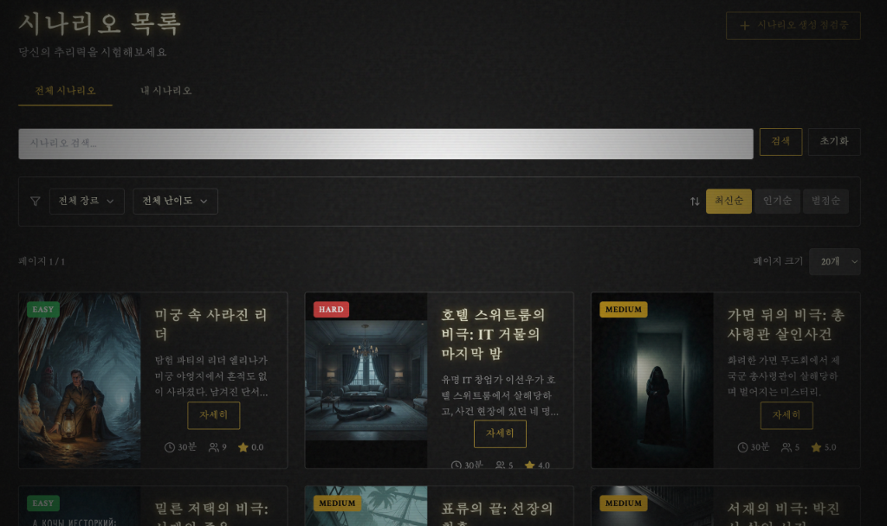
- 네브바 상단 **시나리오 버튼** 클릭
- 이동 주소: https://hongyeon.cloud-ip.cc/scenarios

---

## 5. 시나리오 생성 페이지 이동
- 시나리오 목록 페이지 우측 상단  
  **[+ 시나리오 만들기]** 버튼 클릭
- 이동 주소: https://hongyeon.cloud-ip.cc/create-scenario
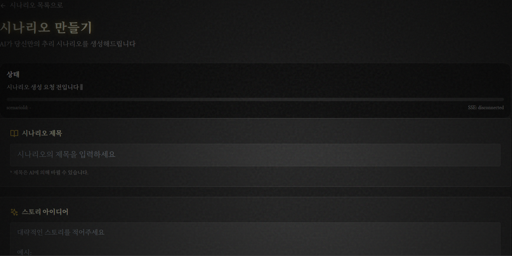
### 5-1. 시나리오 목록 기능
- 다른 유저가 생성한 시나리오 확인 및 플레이 가능
- 기능:
  - 시나리오 검색 (제목 기준)
  - 필터링
    - 장르: 범죄/수사, 미스터리, 공포/스릴러
    - 난이도: Easy, Medium, Hard

### 5-2. 시나리오 상세 페이지
- 썸네일 또는 **자세히 버튼** 클릭 시 이동
- 주소 형식:  
  `https://hongyeon.cloud-ip.cc/scenario/[시나리오 번호]`
- **[게임 시작하기]** 클릭 시  
  **`8. 인게임 플레이`** 단계로 이동

---

## 6. 시나리오 생성 정보 입력

### 입력 항목
- **시나리오 제목**
  - 텍스트 입력
- **스토리 아이디어**
  - 전체 줄거리 및 시놉시스 입력
- **용의자 수**
  - `4명` 또는 `5명` 중 선택
- **장르**
  - 범죄/수사
  - 미스터리
  - 공포/스릴러

### 버튼
- **[시나리오 생성하기]**
  - 화면 우하단
- **[취소]**
  - 화면 좌하단
  - 시나리오 목록으로 복귀

---

## 7. 생성된 시나리오 확인
- 전체 시나리오:
  - https://hongyeon.cloud-ip.cc/scenarios?sortBy=latest
- 내 시나리오:
  - https://hongyeon.cloud-ip.cc/scenarios?tab=mine&sortBy=latest

### 제공 기능
- 시나리오 검색
- 장르 / 난이도 필터
- 정렬
  - 최신순
  - 인기순
  - 별점순

---

## 8. 시나리오 상세 페이지
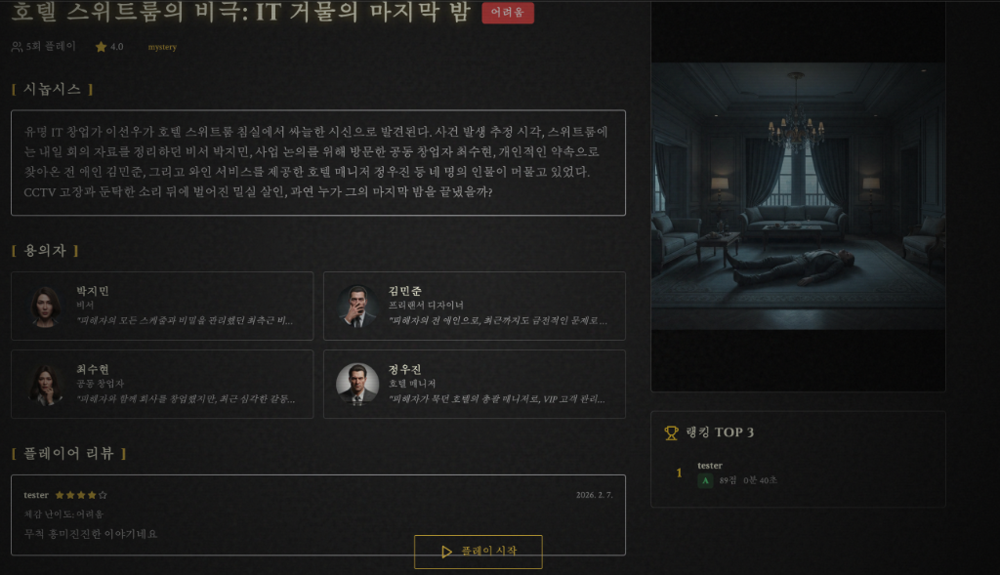
- 주소 예시: https://hongyeon.cloud-ip.cc/scenario/1
- **[플레이 시작]** 버튼 클릭 시 본게임 진입

---

## 9. 인게임 플레이
### 9-1. 프롤로그
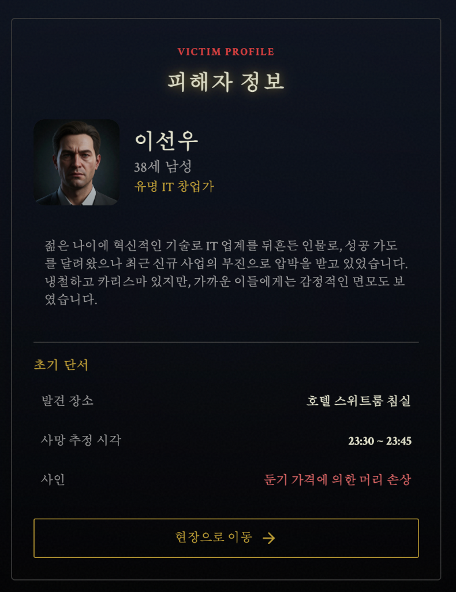
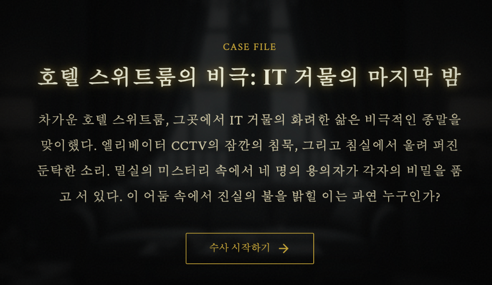
- 사건 케이스에 맞는 프롤로그 제공
- **[수사 시작하기]** 클릭 시:
  - 피해자 이름
  - 나이
  - 배경
  - 발견 장소
  - 사망 추정 시각
  - 사인 정보 제공

---

### 9-2. 증거 획득
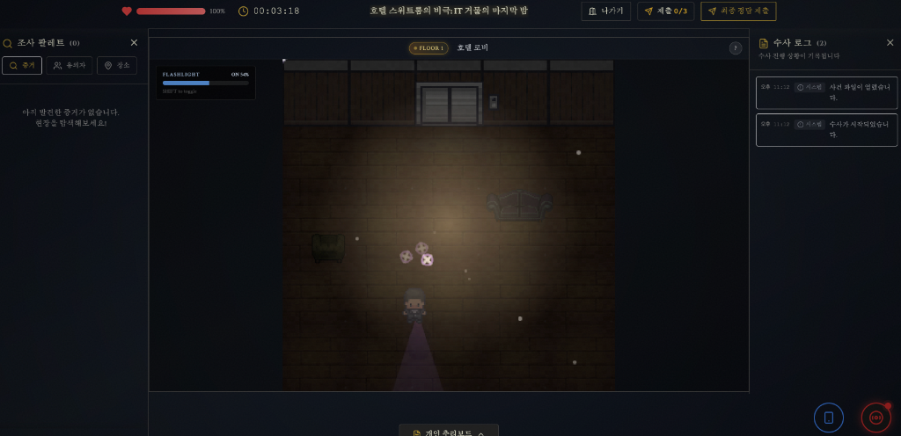
- 날아오는 사물 회피
  - 체력 패널티 없음
  - 스턴 상태로 일정 시간 이동 불가
- **Shift 키**
  - 손전등 켜기 / 끄기
- 손전등 ON 상태에서만 단서 획득 가능
- 에너지 시스템
  - 사용 시 감소
  - 꺼진 상태에서 자동 회복

#### 미니게임 종류 (랜덤)
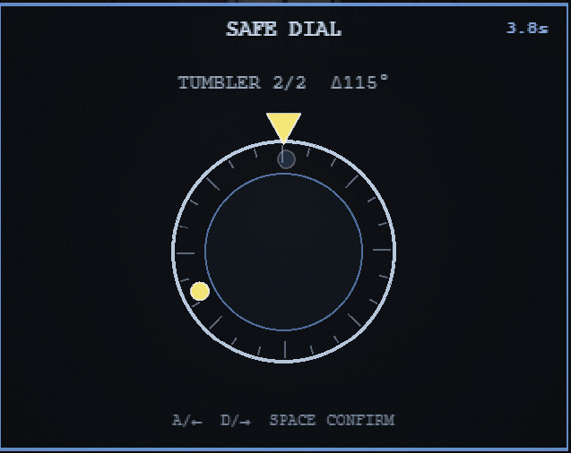
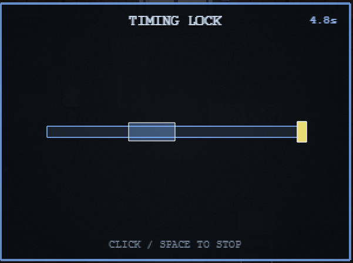
1. **자물쇠 맞추기**
   - 좌우 이동 → 스페이스
2. **키보드 입력**
   - 상/하/좌/우/스페이스 순서 입력
3. **균형 유지**
   - 중앙 영역 유지
4. **타이밍 맞추기**
   - 중앙 진입 시 스페이스

- 실패 시 증거 획득 실패 및 재도전 가능
- 성공 시 증거 획득 및 조수의 코멘트 출력

---

### 9-3. 층계 이동 (1~6층)
- 엘리베이터 이용
- 랜덤 전선 연결 미니게임 발생

#### 전선 연결 미니게임
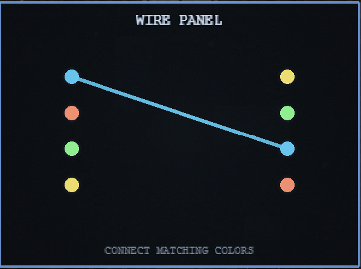
- 같은 색상의 전선 연결
- 4개 전체 동일 색상과 연결 시 클리어 (왼쪽 포인트 클릭 후 오른쪽 포인트 클릭 방식으로 연결)

- 이후 위/아래 방향키로 층 이동
- 각 층의 최초 진입 시 해당 방에 관한 조수의 코멘트 제공

---

### 9-4. 범인 탐문
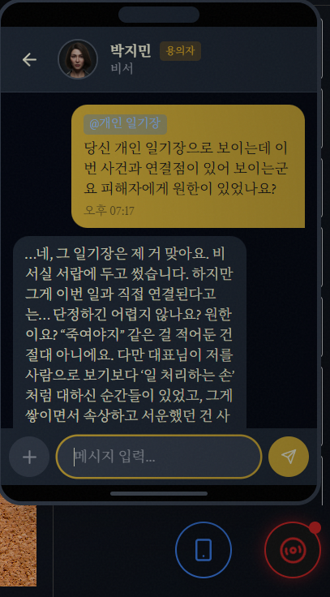
- 우하단 **핸드폰 아이콘** 클릭
- 문자메시지 형태의 대화 UI
- 자유로운 AI 대화 가능
- 게임 외 질문은 제한됨

#### 탐문 제한
- 체력 100
- 대화 1회당 체력 5 감소
- 하나의 시나리오당 총 20회 제한

#### 증거 제출
- 대화 중 증거 제출 가능
- 범인에 따라 적절한 증거를 제출 시 결정적인 증언 확보 가능

---

### 9-5. 추리 보드
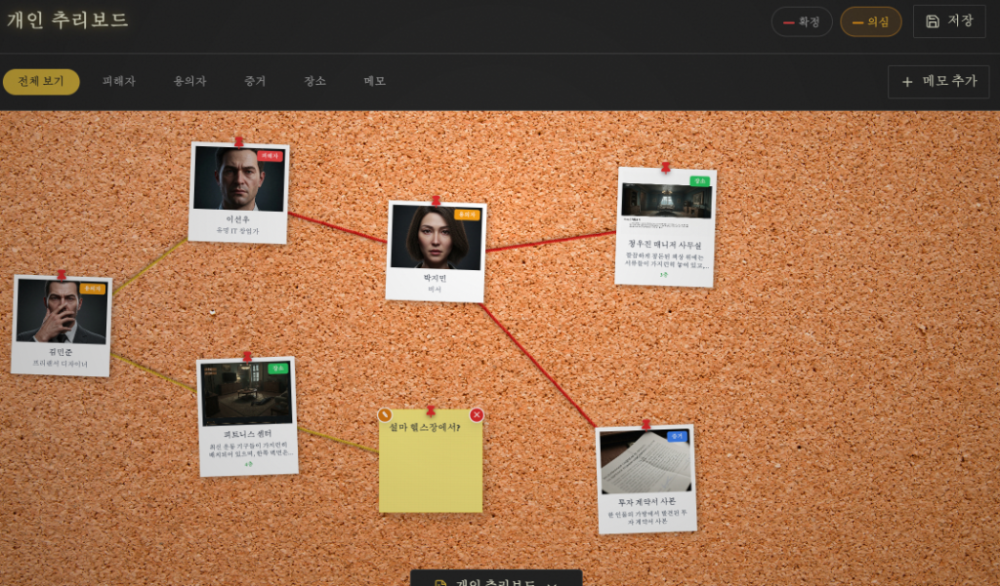
#### 확정 (붉은선)
- 필수 3개 연결:
  - 범인
  - 범행 장소
  - 범행 도구
- 범행 동기에 대한 추리 서술
- 최종 평가에 반영됨

#### 의심 (노란선)
- 추리 과정용
- 최종 평가 미반영

#### 메모
- 자유 기록
- 최종 평가 미반영

- **[저장하기]** 필수
- 조건 충족 시 **[최종 제출]** 가능
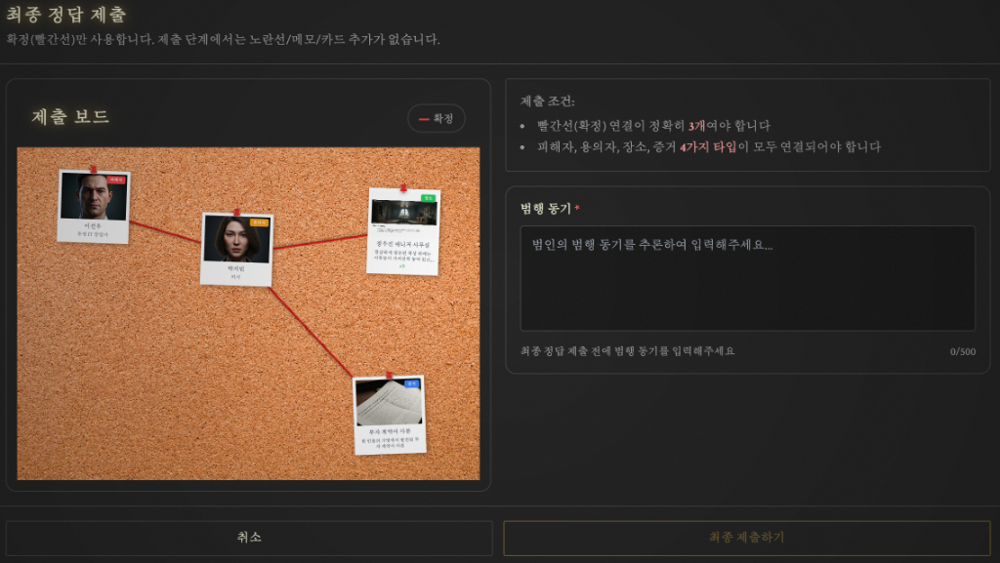
- 제출 후 범행 동기 서술
- 총 3회 제출 기회 제공

---

### 9-6. 추리 결과

#### 추리 성공
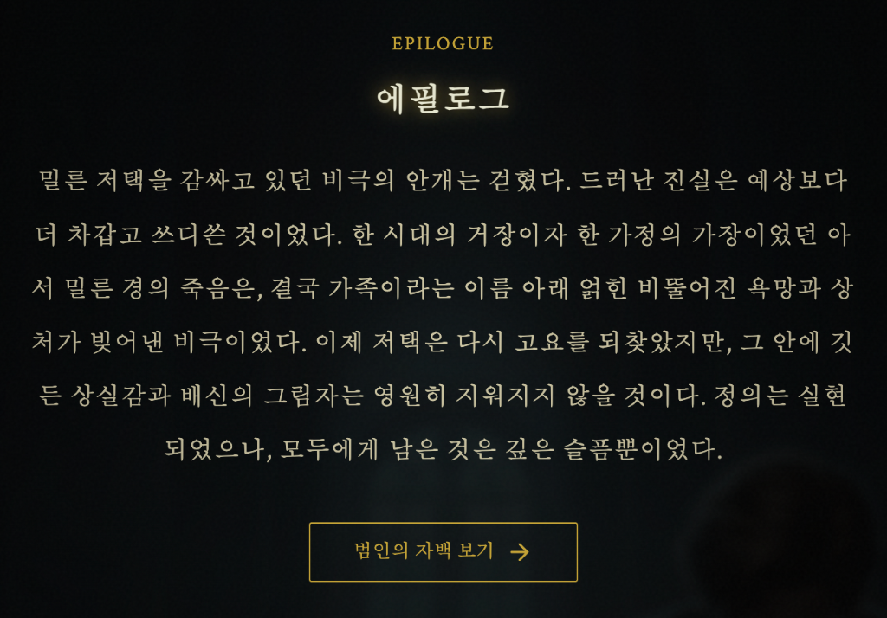
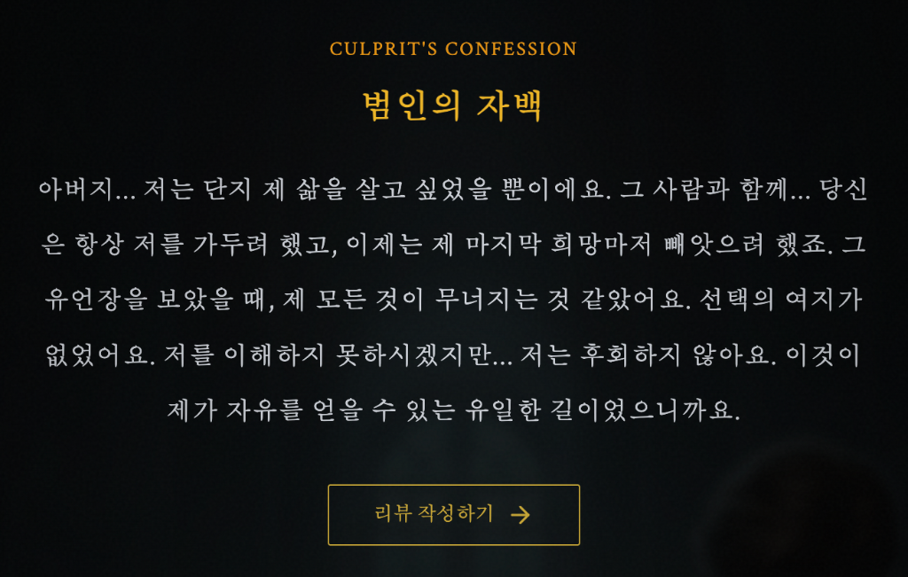
- 에필로그 제공
- **[범인의 자백 보기]**
- 리뷰 작성
- 점수 및 평가 제공
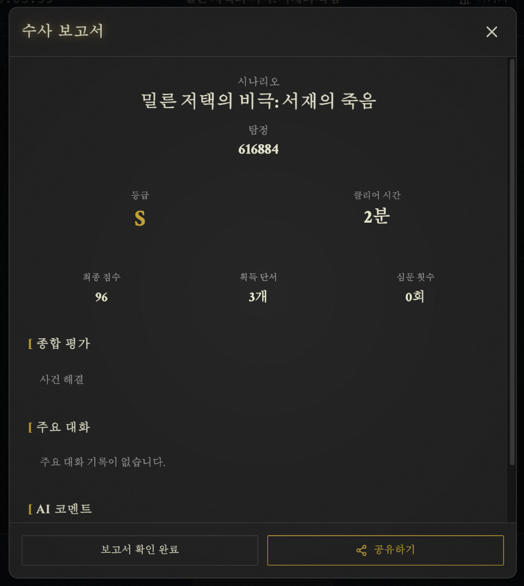
- **[홈으로 돌아가기]**

#### 추리 실패
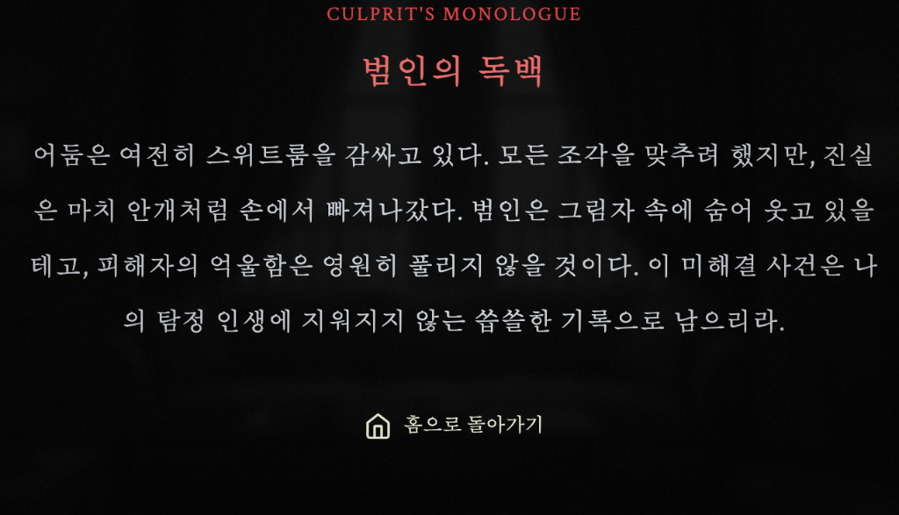
- 3회 실패 시 수사 실패
- 범인의 독백(실패) 제공
- 홈으로 이동 가능

---

## 10. 내 수사록
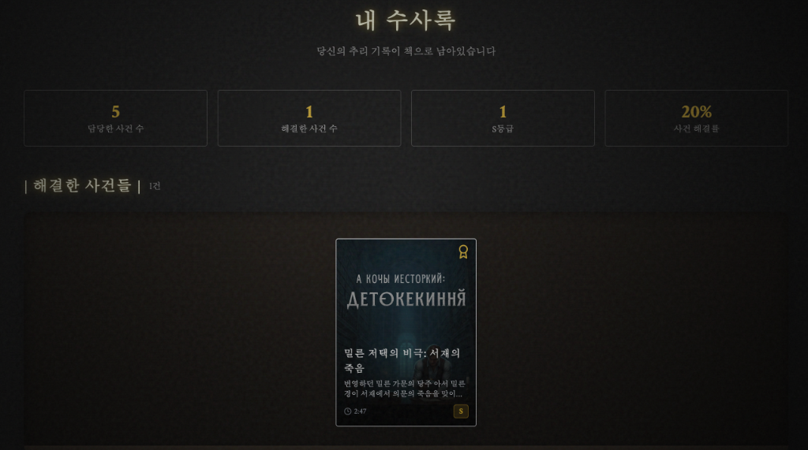
- https://hongyeon.cloud-ip.cc/my-bookshelf

### 통계 정보
- 담당한 사건 수
- 해결한 사건 수
- S 등급
- 사건 해결률

### 분류
- 해결한 사건들
- 진행중인 사건들
- 미제 사건들

---

## 11. 랭킹 페이지
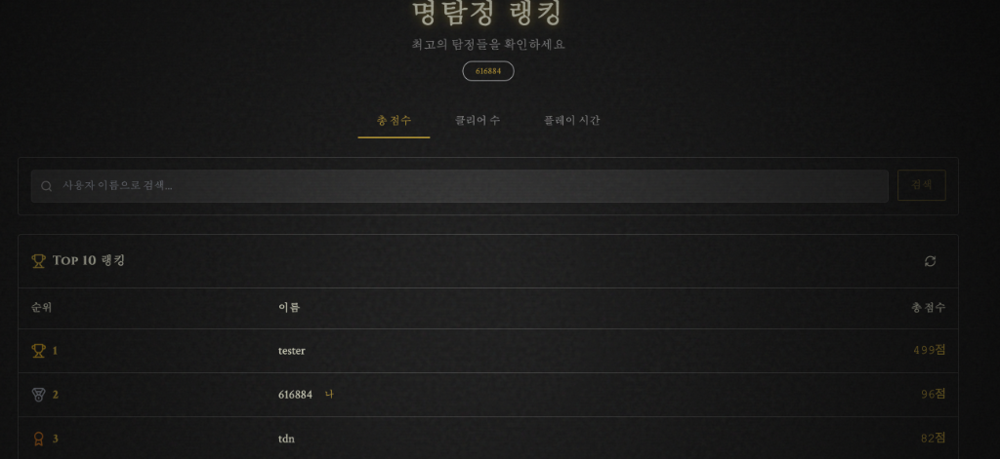
- https://hongyeon.cloud-ip.cc/ranking

### 랭킹 기준
- 총 점수
- 클리어 수
- 플레이 시간

- 사용자 ID 검색 가능

---

## 12. 배경 음악 기능
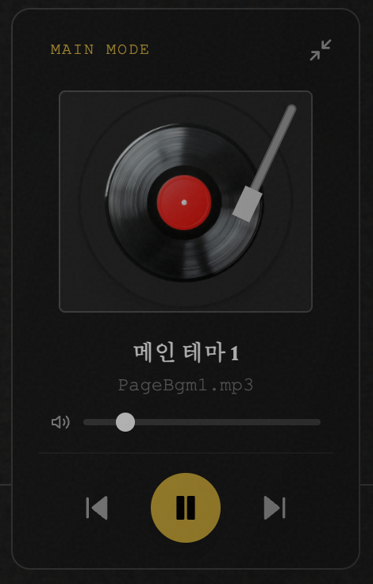
- 웹 BGM
  - 메인 테마 1
  - 메인 테마 2
- 인게임 BGM
  - 게임 BGM 1
  - 게임 BGM 2

### 기능
- 재생 / 정지
- 이전 / 다음 곡
- 볼륨 조절
- 화면 우하단 턴테이블 UI
